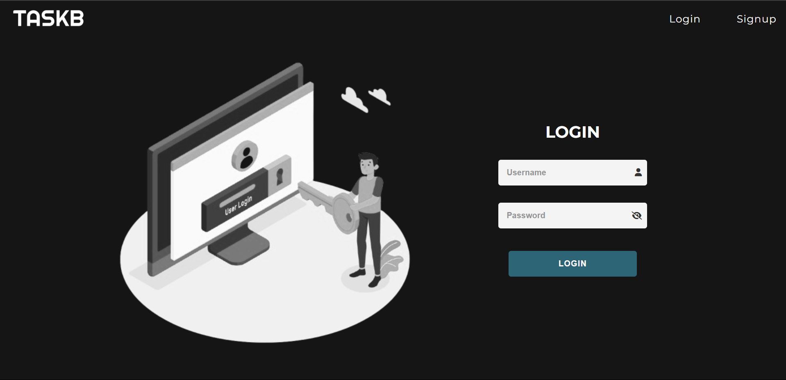
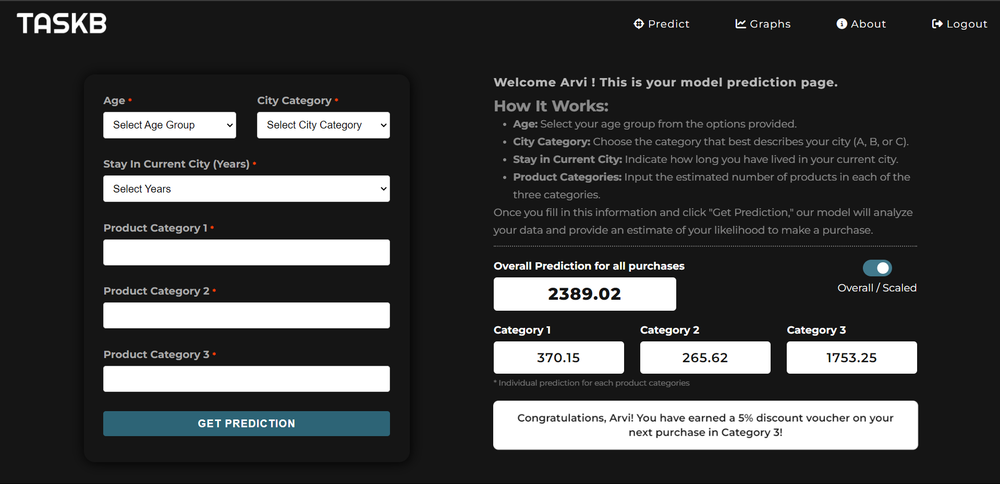
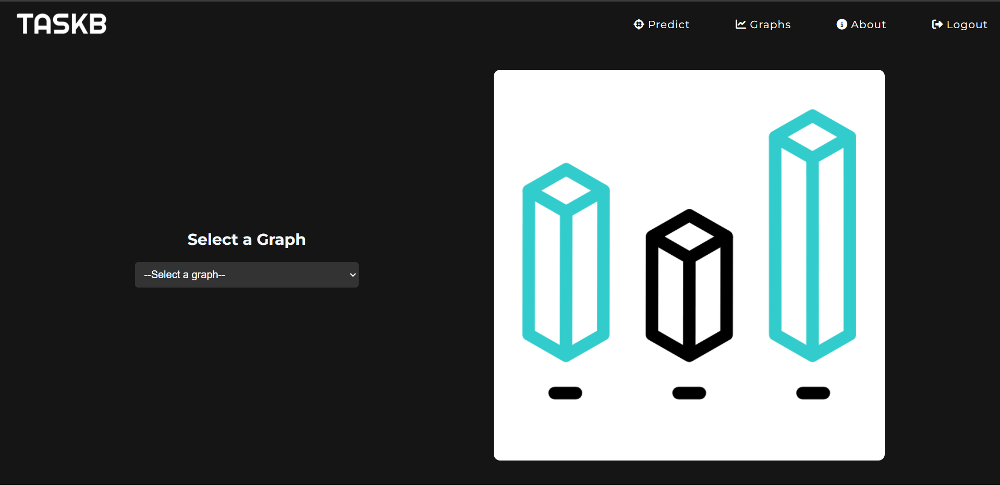
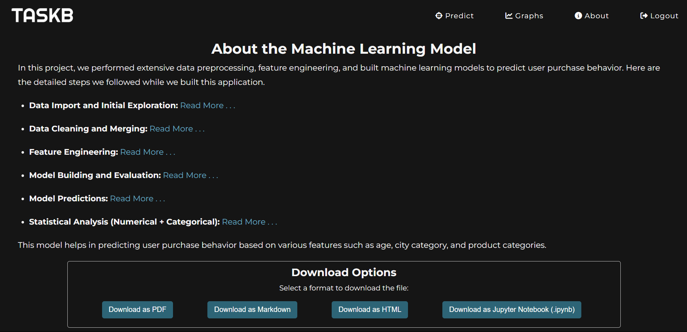

# Black Friday 
## Capstone

Welcome to the Purchase Prediction Model project! This application leverages machine learning techniques to predict user purchase behavior based on demographic and product category data.

## Table of Contents

- [Features](#features)
- [How It Works](#how-it-works)
- [Data Description](#data-description)
- [Model Building](#model-building)
- [Installation](#installation)
- [About the Framework](#about_the_framework)


## Features

- User login and signup
- Predict purchase likelihood based on user info
- Visualize purchase data

## How It Works

1. **User Input**: Enter your age, city category, how long you’ve lived in your city, and product quantities.
2. **Prediction**: The model uses this info to estimate your likelihood to purchase.
3. **Results**: Get overall predictions and category-specific predictions, plus a discount voucher.

## Data Description

The project uses two datasets:
- `user_demographics.csv`: User demographic info
- `User_product_purchase_details_p2.csv`: User purchase data

## Model Building

1. **Data Handling**: Import libraries and load datasets.
2. **Data Cleaning**: Merge datasets and handle missing values.
3. **Feature Engineering**: Create new features to improve predictions.
4. **Modeling**: Build and evaluate models (Decision Tree and Random Forest).
5. **Predictions**: Use the best model to make predictions.

## Installation

To set up locally:

1. Clone the repo:
   ```bash
   git clone https://github.com/Aravinth-S-731/Black-Friday.git
   ```


2. Installing requirements:
    ```bash
   python -m venv your-venv-name

   your-venv-name/Scripts/activate
   
   pip install -r requirements.txt
   ```

3. Run Python app:

   1. For the first time run the below command to create model.pkl
   ```bash
   python model.py
   ```

   2. To run web app use this code
   ```bash
   python app.py
   ```
4. Open web application
   ```
   http://127.0.0.1:5000/login
   ```

## About the Framework

This application is built using **Flask**, a lightweight WSGI web application framework in Python. Flask is known for its simplicity and flexibility, making it an excellent choice for developing small to medium-sized web applications. 

### Key Features of Flask Used in This Project:

- **Blueprints**: We utilized Flask Blueprints to organize the application into modular components, making the codebase easier to manage and scale.
- **Routing**: Flask’s routing capabilities allow for clean and intuitive URL management.
- **Templates**: Jinja2 templating engine is used for rendering HTML, providing a clear separation between logic and presentation.
- **RESTful API**: The application is designed to handle requests and responses in a RESTful manner, making it suitable for various frontend technologies.

Flask’s minimalistic approach helped streamline development, allowing us to focus on implementing features efficiently.

## Application Screenshots

### Login Page


### Signup Page


### Predict Page


### Graph Page


### About Page


---


## File Structure

```
Black_Friday
|
|--- .venv
|
|--- authentication
|       |
|       |--- Static
|       |--- templates
|       |--- authentication.py
|
|--- graphs
|       |
|       |--- Static
|       |--- templates
|       |--- graphs.py
|
|--- model_prediction
|       |
|       |--- Static
|       |--- templates
|       |--- model_prediction.py
|
|--- model.csv
|--- model.pkl
|--- model.py
|--- README.md
|--- requirements.txt
|--- users.pkl
|--- app.py

```